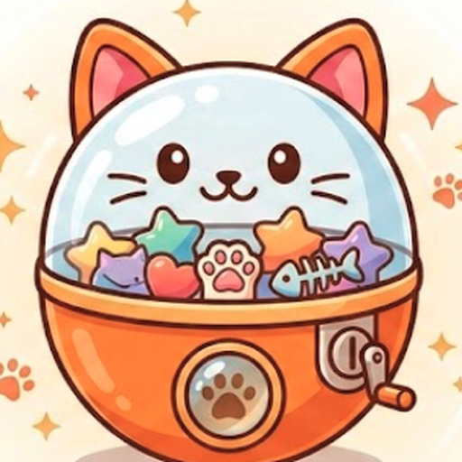

# Catchapon - Night Shift Gacha

<p align="center">
  
</p>

<p align="center">
  <strong>A cozy first-person browser game about working the late shift in a strange little gacha shop.</strong>
</p>

<p align="center">
  <a href="https://catchapon.vercel.app/">Play on Vercel</a>
  ·
  <a href="https://talhaabidj.itch.io/catchapon">Play on itch.io</a>
</p>

---

## Shift Briefing

You clock in after dark, step through your bedroom door, and arrive at a warm, machine-filled gacha shop that probably should not exist.

Your job is simple:

- keep the machines running,
- clean up the shop,
- restock capsules,
- earn Catcha Credits,
- buy tickets,
- pull gachas when nobody is watching,
- and bring your collection home before the night is over.

Catchapon is built around a compact first-person loop: **Desktop -> Bedroom -> Shop -> Reveal -> End of Night -> Bedroom**.

## Play The Night

Explore two connected spaces:

- **Bedroom Hub** - your PC, profile, settings, collection wall, and the door to work.
- **Night Gacha Shop** - rows of themed machines, floor tasks, token exchange, secrets, and shift goals.

During a shift you can:

- wipe machine glass,
- pick up trash,
- scrub mud splashes,
- restock low machines,
- fix jams,
- reconnect unplugged machines,
- exchange credits for tickets,
- pull from rarity-weighted gachas,
- preview machine drop odds,
- trade duplicates at the Wonder Exchange,
- and hunt for hidden machines and time-based rare pulls.

## Machine Sets

Each main gacha machine has a themed collection with six rarity tiers: common, uncommon, rare, epic, legendary, and mythical.

| Machine           | Collection Theme                             |
| ----------------- | -------------------------------------------- |
| Kitty Cakes       | Dessert cats from a late-night feline bakery |
| If I Fits I Sits  | Cats in increasingly impossible containers   |
| Cats Vs Cucumbers | The legendary produce rivalry                |
| Meme Meownia      | Classic internet cat chaos                   |
| Loaf Legends      | Late-night speed, loafing, and mischief      |
| Astro Whiskers    | Space cats, comets, and void royalty         |
| Wonder Exchange   | Duplicate trading for surprise pulls         |
| Mythic Backroom   | Secret high-rarity pulls                     |

## Controls

| Action                     | Input           |
| -------------------------- | --------------- |
| Move                       | `W` `A` `S` `D` |
| Look                       | Mouse           |
| Interact                   | `E`             |
| Service / alternate action | `R`             |
| View machine drops         | `F`             |
| Close / cancel             | `Q`             |
| Pause                      | `Esc`           |

The game uses pointer lock in first-person scenes. After pausing or returning from certain overlays, click the continue screen to resume camera control.

## Tech Stack

| Layer     | Technology                                             |
| --------- | ------------------------------------------------------ |
| Rendering | Three.js / WebGL2                                      |
| Language  | TypeScript                                             |
| Build     | Vite                                                   |
| UI        | Vanilla DOM + HTML/CSS overlays                        |
| Audio     | Howler.js                                              |
| Save Data | LocalStorage                                           |
| Tests     | Vitest + Playwright                                    |
| Hosting   | Vercel, itch.io HTML5 ZIP, Wavedash-ready static build |

## Project Structure

```text
src/
  core/       game loop, renderer, input, audio, save, metrics
  data/       machines, items, sets, progression, shared types
  scenes/     desktop, bedroom, shop, reveal, end flow
  systems/    economy, collection, tasks, maintenance, capsules
  ui/         DOM overlays and HUDs
  world/      Three.js room, props, machines, shop geometry
tests/
  unit/       Vitest coverage for systems and data
  e2e/        Playwright smoke tests
public/
  textures/   shipped browser assets
```

## Local Development

```bash
npm install
npm run dev
```

The dev server runs at:

```text
http://localhost:3000
```

Useful commands:

```bash
npm run lint
npm run test
npm run build
npm run test:e2e
npm run preview
```

## Release Builds

### Vercel

- Framework preset: Vite
- Build command: `npm run build`
- Output directory: `dist`

### itch.io

```bash
npm run build
cd dist
zip -r ../catchapon-itch-upload.zip .
```

Upload `catchapon-itch-upload.zip` as an HTML5/browser game. The ZIP must contain `index.html` at the root.

### Wavedash

The production build is static and Wavedash-ready.

```bash
npm run build
wavedash build push
```

Before using the Wavedash CLI, set the correct game id in `wavedash.toml`.

## Quality Bar

Before a release, run:

```bash
npm run lint
npm run test
npm run build
```

For gameplay-sensitive changes, also run:

```bash
npm run test:e2e
```

Manual checks that matter most:

- Desktop -> Bedroom -> Shop flow
- pause / resume pointer lock
- machine pull flow
- service tasks and floor tasks
- token exchange and Wonder Exchange
- end-of-night return home
- collection wall and collection UI

## License

Catchapon is source-available for learning, inspection, and non-commercial use.

- Code: custom non-commercial, attribution-required license. See [LICENSE](./LICENSE).
- Default assets, models, textures, audio, narrative text, and UI: Creative Commons BY-NC-SA 4.0. See [ASSETS_LICENSE.md](./ASSETS_LICENSE.md).
- Some specific low-poly models use Creative Commons BY 4.0 and are listed in [ASSETS_LICENSE.md](./ASSETS_LICENSE.md).

Gameplay videos and streams are allowed to be monetized as long as they credit:

```text
Catchapon - Night Shift Gacha by Talha Abid
```

## Credits

- **Talha Abid** - game design, code, systems, worldbuilding, implementation, and release work.
- **Sarah Lusher** - QA testing, UI/UX design, design feedback, and bug hunting.

---

Made with TypeScript, Three.js, and a suspicious number of capsule machines.
